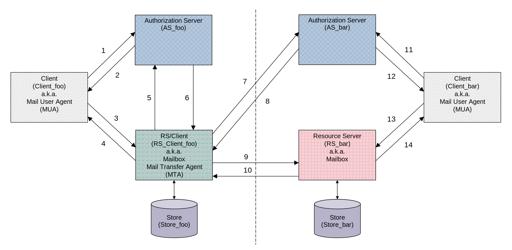

# Federizer

## Introduction

Email has long been the primary means of exchanging important information. It serves as an interpersonal communication tool and is often the default choice for sending files. Despite its central role, the email ecosystem still relies on a 50-year-old architecture.

We introduce Federizer, an Internet mail system built on a modernized architecture. It enables users to exchange messages, documents, books, photos, podcasts, and videos via the Internet. By redefining the foundation of email, Federizer delivers the efficiency, security, and scalability needed to meet today’s communication demands.

## Architecture

    Fig.&nbsp;1.&emsp;Architecture of Federizer.

