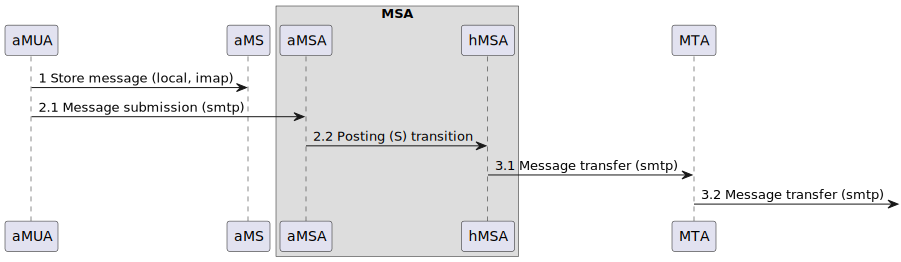
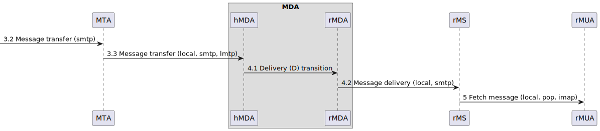
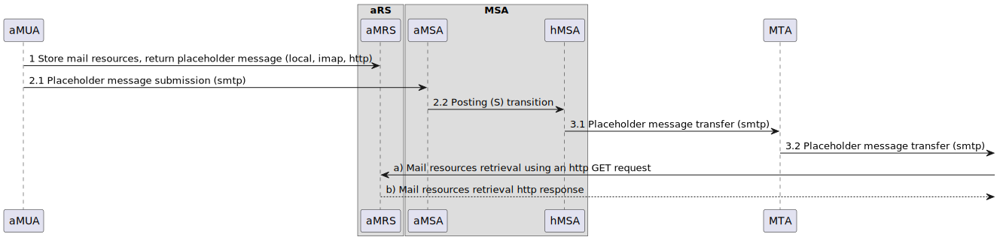
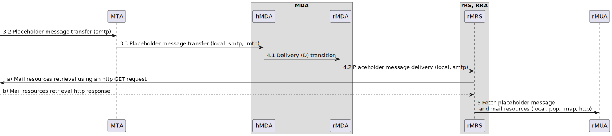

# Authorization-Enhanced Internet Mail Architecture

## Current Internet Mail Architecture (RFC5598)


<p class="figure">
    Fig.&nbsp;1.&emsp;Current Internet mail architecture (rfc5598), message flow part I.
</p>


<p class="figure">
    Fig.&nbsp;2.&emsp;Current Internet mail architecture (rfc5598), message flow part II.
</p>

## Authorization-Enhanced Internet Mail Architecture


<p class="figure">
    Fig.&nbsp;3.&emsp;Authorization-enhanced Internet mail architecture, information flow part I.
</p>


<p class="figure">
    Fig.&nbsp;4.&emsp;Authorization-enhanced Internet mail architecture, information flow part II.
</p>

#### *Key Points*

Each email consists of a *placeholder message* and associated external body resources (message bodies) stored on the Mail Resource Store (MRS) of the respective Resource Server (RS). The information flow illustrated in Figure 3 and Figure 4 includes the following key points:

- An author using aMUA stores the mail body resources on the aMRS, where a *placeholder message* is created, stored and finally returned in the response. This *placeholder message* stores, in its headers, the URL of the author RS and the cryptographic hash values of the referenced body resources (see the [Placeholder Message Example](#placeholder-message-example)).

- The mail body resources owned by the author stored on the aMRS are shared with recipients, while the *placeholder message* stored on the aMRS acts as an access control list. Following a successful sharing process, the *placeholder message* is sent to each recipient using the current Internet mail infrastructure. Tip: Send the *placeholder message* in JSON format as an email attachment.

- After receiving a *placeholder message* on the recipient's side the rMDA adds a header containing the recipient's RS URL to the *placeholder message* and stores it on the rMRS.

- The Resource Retrieval Agent (RRA) running on the rRS obtaines the URL of the author's RS and the cryptographic hash values of the referenced body resources from the *placeholder message*. Using the authentication mechanism of the [Internet Mail Federation Protocol](Internet_Mail_Federation_Protocol.md), the RRA attempts to retrieve the external body resources from the aMRS. After successful authentication, the data is retrieved and stored on the rMRS of the author's RS. Finally, the rMUA fetches the relevant data from the rMRS of the recipient's RS and reconstructs the original message according to the *placeholder message* source.

## Placeholder Message

#### *Placeholder Message Example*

An example of placeholder message in JSON format with external bodies accessible via content-addressed URIs.

```json
{
  "headers":
    {
      "X-Author-RS-URL": "https://foo.com/rs",
      "X-Recipient-RS-URL": "https://bar.com/rs",
      "From": "Alice Sanders <alice@foo.com>",
      "Subject": "Meeting",
      "To": "Bob Sanders <bob@bar.com>",
      "Cc": "Carol <carol@bar.com>, Daniel <dan@bar.com>",
      "Date": "Tue Sep 19 20:52:05 CEST 2023",
      "Message-ID": "<b07d0cdf-c6f4-4f67-b24c-cc847a4c2df4@foo.com>",
      "X-Thread-ID": "<68fb9177-6853-466a-8f7d-c96fbb885f81@foo.com>",
      "Content-Type": "multipart/mixed"
    },
  "parts":
    [
      {
        "headers": { "Content-Type": "multipart/alternative" },
        "parts":
          [
            {
              "headers":
                {
                  "Content-Disposition": "inline",
                  "Content-ID": "<aSQnmlBT6RndpDnwTSStJUVhlh9XL9_y2QXX42NhKuI>",
                  "Content-Type":
                    [
                      "message/external-body; access-type='x-content-addressed-uri'; hash-algorithm='sha256'; size='42'",
                      "text/plain; charset=UTF-8"
                    ]
                }
            },
            {
              "headers":
                {
                  "Content-Disposition": "inline",
                  "Content-ID": "<Y_ION3g8WQuqGzhsDlVrhAgQ0D7AbXu9T-HSv3w--zY>",
                  "Content-Type":
                    [
                      "message/external-body; access-type='x-content-addressed-uri'; hash-algorithm='sha256'; size='109'",
                      "text/html; charset=UTF-8"
                    ]
                }
            }
          ]
      },
      {
        "headers": { "Content-Type": "multipart/mixed" },
        "parts":
          [
            {
              "headers":
                {
                  "Content-Disposition": "attachment; filename='logo.svg'",
                  "Content-ID": "<1pzyqfFWbfhJ3hrydjL9jO9Qgeg70TgZQ_zpOkt4HOU>",
                  "Content-Type":
                    [
                      "message/external-body; access-type='x-content-addressed-uri'; hash-algorithm='sha256'; size='52247'",
                      "image/svg+xml"
                    ]
                }
            },
            {
              "headers":
                {
                  "Content-Disposition": "attachment; filename='Minutes.pdf'",
                  "Content-ID": "<6G6Mkapa3-Om7B6BVhPUBEsCLP6t6LAVP4bHxhQF5nc>",
                  "Content-Type":
                    [
                      "message/external-body; access-type='x-content-addressed-uri'; hash-algorithm='sha256'; size='153403'",
                      "application/pdf"
                    ]
                }
            }
          ]
      }
    ]
}
```


