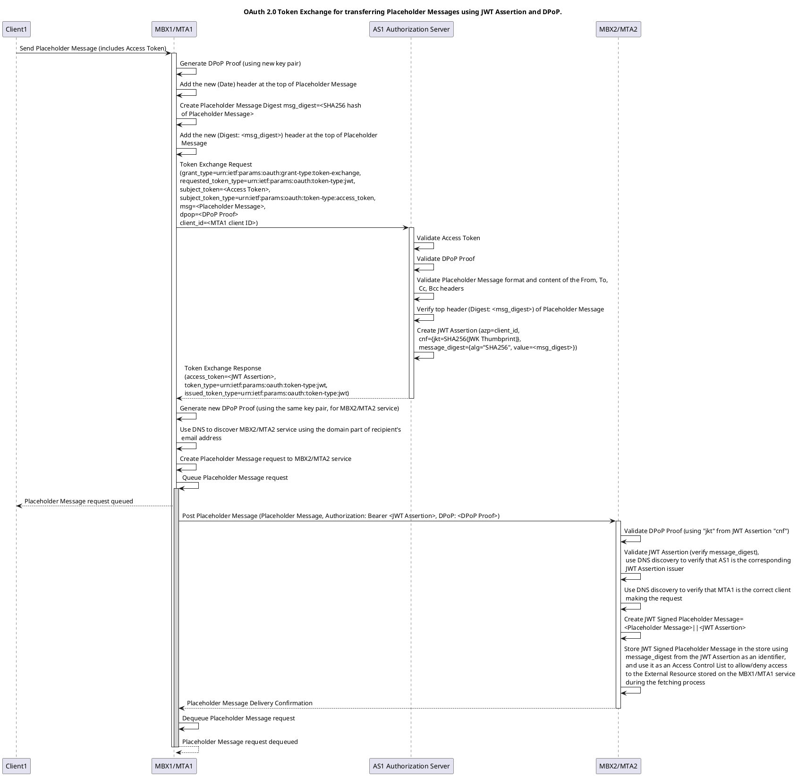
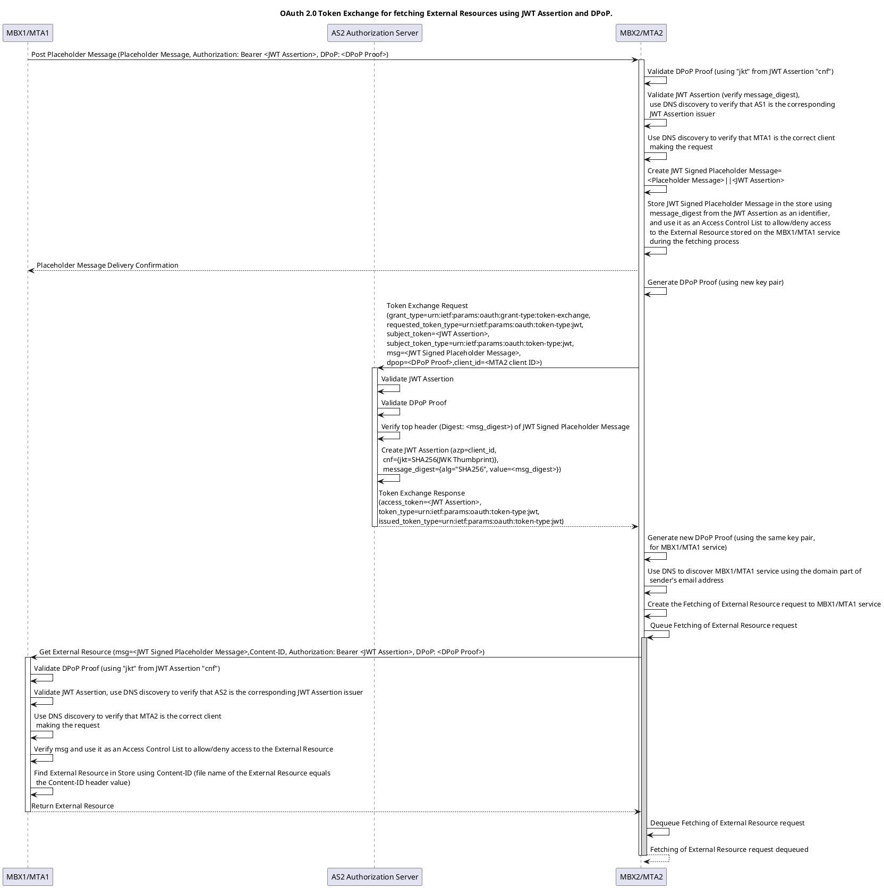
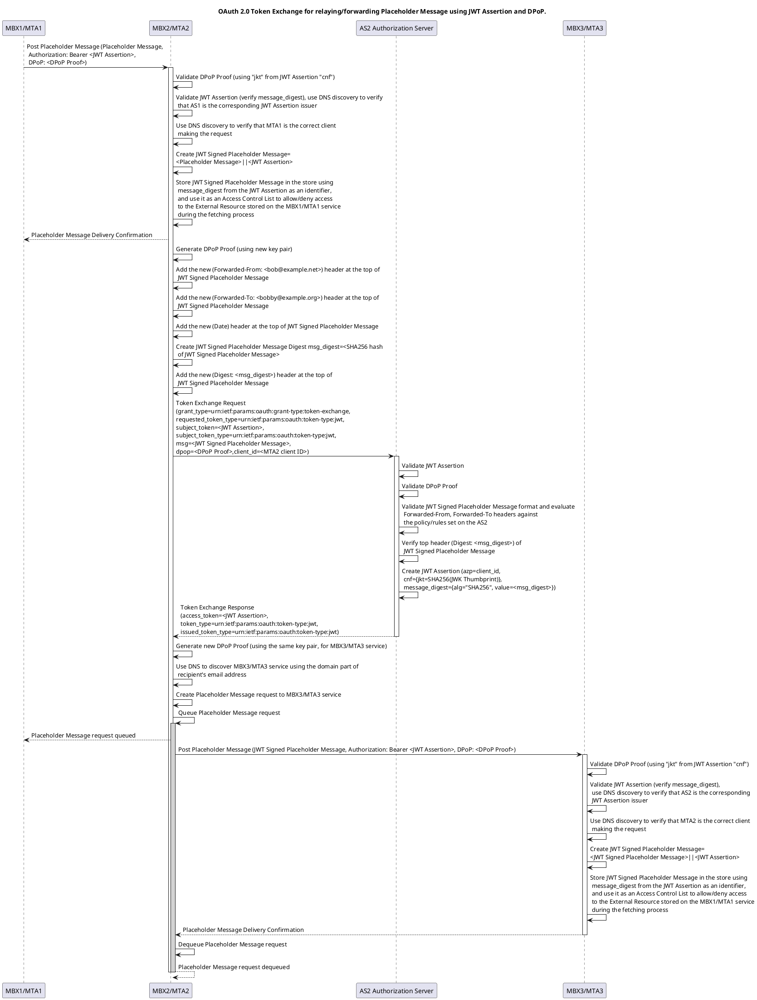

# System Instructions

You are an expert in OAuth 2.0 and email system. You are an experienced frontend and backend developer. You know how to code in these languages (a) Golang, SQL (b) HTML, Javascript/Typescript, CSS and you know how to use React framework with styled-components. You can write API documentation using OpenAPI 3.1 specification. You know how to design a synchronization protocol to synchronize data between backend services and a frontend application.

# The Federizer Project

We aim to create an Internet mail system, similar to the current email system, that facilitates the transmission of various types of data, such as messages, documents, books, photos, podcasts, and videos, using a set of OAuth 2.0 mechanisms.

# Logic

## Placeholder Message and External Resources

Each email entity consists of a Placeholder Message and its associated External Resources—the message bodies stored within the mailbox.

The Placeholder Message also serves as an Access Control List, granting access to the External Resources to the individuals specified in the message headers: "From", "To", "Cc", "Bcc", "Forwarded-From", and "Forwarded-To".

Owners of the External Resources can send each recipient a copy of the Placeholder Message, signed by their agent. This action notifies the recipients' agents to fetch the corresponding External Resources.

## Contextual Discharge

As Placeholder Messages pass through each mailbox service, a chronological sequence of signed Placeholder Messages is formed.

To grant recipients access to External Resources that are confined to the owner, a chain of signed Placeholder Messages can be presented. This enables access and allows the recipients to fetch the External Resources.

Upon fetching the External Resources, each recipient gains ownership of the copies stored in their mailbox.

## Concept

### Acronyms

For the sake of brevity of this document, the following list of acronyms will be used:

* AS: Authorization Server
* RS: Resource Server
* MTA: Mail Transfer Agent
* MBX: Mailbox
* APP: Webmail Application

### Components

Suppose we have two trust domains, example.com and example.net, and two users: (a) Alice with the email address alice@example.com, and (b) Bob with the email address bob@example.net. These domains and users do not have any pre-established trust relationship, nor do we intend to create any permanent trust relationship (e.g. through federation) between the trust domains.

We have the following components:

* Authorization Server (AS1): Operates under the example.com trust domain.

* Authorization Server (AS2): Operates under the example.net trust domain.

* Client (Client1): Operates under the example.com trust domain and serves as Alice's Webmail application (APP1).

* Client (Client2): Operates under the example.com trust domain and serves as Alice's Mail Transfer Agent (MTA1)

* Client (Client3): Operates under the example.net trust domain and serves as Bob's Mail Transfer Agent (MTA2)

* Client (Client4): Operates under the example.net trust domain and serves as Bob's Webmail application (APP2).

* Resource Server (RS1): Operates under the example.com trust domain and serves as Alice's Mailbox (MBX1).

* Resource Server (RS2): Operates under the example.net trust domain and serves as Bob's Mailbox (MBX2).

* MBX1 and MTA1: We will refer to them collectively as the MBX1/MTA1 entity, that acts in a dual role and functions as both a service and an agent:

  * Acts as an RS1 with respect to Client1 or Client3.

  * Acts as a Client2 with respect to RS2.

* MBX2 and MTA2: We will refer to them collectively as the MBX2/MTA2 entity, that acts in a dual role and functions as both a service and an agent:

  * Acts as an RS2 with respect to Client4 or Client2.

  * Acts as a Client3 with respect to RS1.

The MTA allows bidirectional data transfer, it can send and receive resources using the POST and GET http methods. That allows to deliver Alice's resources to Bob in two different ways:

1. Alice's MTA1 sends her resources to Bob's MBX2.

2. Alice temporarily shares her resources to Bob on her MBX1 and sends a notification message (a Placeholder Message, see Fig. 1) via MTA1 to Bob's MBX2/MTA2 service. Next, the Bob's MTA2 fetches the resources from Alice's MBX1/MTA1 service.

Taking into account both ways of transferring Alice's resources to Bob and highlight the symmetry of the system (Alice can deliver her resources to Bob in two ways; Bob can deliver his resources to Alice in two ways) we can summarize the concept of dual roles as follows:

* the MBX1/MTA1 acts as RS1 when Alice posts/gets her resources via APP1.

* the MBX1/MTA1 acts as Client2 when transferring Alice's resources to Bob's MBX2.

* the MBX1/MTA1 acts as RS1 when Bob's MTA2 fetches Alice's shared resources from Alice's MBX1.

* the MBX2/MTA2 acts as RS2 when Bob posts/gets his resources via APP2.

* the MBX2/MTA2 acts as Client3 when transferring Bob's resources to Alice's MBX1.

* the MBX2/MTA2 acts as RS2 when Alice's MTA1 fetches Bob's shared resources from Bob's MBX2.

### OAuth 2.0 Flow

We utilize two OAuth 2.0 grant types:

1. Authorization Code Grant with PKCE: Facilitates user-driven interactions (e.g., Alice or Bob accessing their respective mailboxes using Webmail applications).

2. Token Exchange (RFC 8693) for Email Transfer with JWT Assertion and the Demonstrating Proof of Possession (DPoP) mechanism using the "message_digest" claim: Authorizes automated service-to-service interactions (e.g., Alice's MTA1 accessing Bob's Mailbox MBX2). We call this complex authorization mechanism Cross-Domain Authorization Grant and will describe it in more detail later.

### Client Registration

We use the following OAuth 2.0 Client Registration Schema:

* The APP1 is registered at the AS1 as a public client.

* The APP2 is registered at the AS2 as a public client.

* The MBX1/MTA1 is registered at the AS1 as a confidential client.

* The MBX2/MTA2 is registered at the AS2 as a confidential client.

### Service Discovery

In the OAuth 2.0-based internet mail architecture, the mailbox (locator) and the email address (user identity identifier) are separated. This separation allows users from the example.com trust domain to have their mailboxes hosted in another domain, such as example.edu. This architecture always requires two DNS records: one for the identity provider and another for the storage provider. However, both providers may operate under the same trust domain, as we will assume in the following description.

We implement service discovery using these DNS records:

1. `_federizer._as._tcp.example.com. 3600 IN SRV 10 5 443 as1.example.com.`

   * Points either: (a) directly to the authorization service, or (b) to a redirect service that redirects http requests to the URL of the authorization service (e.g., example.com/as1), see Note 1. This is used by the MBX2/MTA2 service to verify that Alice's AS1 is the corresponding JWT Assertion issuer.

2. `_federizer._rs._tcp.example.com. 3600 IN SRV 10 5 443 rs1.example.com.`

   * Points either: (a) directly to the resource server, or (b) to a redirect service that redirects http requests to the URL of the resource server (e.g., example.com/rs1), see Note 1. This is used by the MBX2/MTA2 agent to discover the MBX1/MTA1 service and by the MBX2/MTA2 service to verify that the MBX1/MTA1 agent is the correct client making the request, see Note 2.

3. `_federizer._as._tcp.example.net. 3600 IN SRV 10 5 443 as2.example.net.`

   * Points either: (a) directly to the authorization service, or (b) to a redirect service that redirects http requests to the URL of the authorization service (e.g., example.net/as2), see Note 1. This is used by the MBX1/MTA1 service to verify that Bob's AS2 is the corresponding JWT Assertion issuer.

4. `_federizer._rs._tcp.example.net. 3600 IN SRV 10 5 443 rs2.example.net.`

   * Points either: (a) directly to the resource server, or (b) to a redirect service that redirects http requests to the URL of the resource server (e.g., example.net/rs2), see Note 1. This is used by the MBX1/MTA1 agent to discover the MBX2/MTA2 service and by the MBX1/MTA1 service to verify that the MBX2/MTA2 agent is the correct client making the request, see Note 2.

Note 1: DNS SRV records cannot point to a URL with a path, while using a URL with a specific path is common for Authorization Servers or Resource Servers. A trusted redirect service can run on the hostname specified in the SRV record and redirect (e.g., a 302 Found) http requests to the actual URL of the Authorization Server or Resource Server, including the path.

Note 2: We utilize the dual role feature of MBX1/MTA1 and MBX2/MTA2 entities to provide metadata about Client2 and Client3. When each MTA is registered with its respective AS as a confidential client, the sibling MTX resource server can supply metadata about its MTA, including the MTA client_id. This client_id, also included in the JWT Assertion as an "azp" claim, is used to verify that the correct client is making the request.

### Conceptual Example

* The External Resources owned by the author stored on the RS of the origin mailbox service are temporarily shared with recipients by creating a Placeholder Message which also acts as an Access Control List. Following a successful sharing process, using the Cross-Domain Authorization Grant, the Placeholder Message is sent to each recipient through the MTA operating within the origin trust domain. This Placeholder Message stores SHA-256 digests of the referenced External Resources in its `Content-ID` headers (see Figure 1 for an example of a Placeholder Message).

* The MTA operating within the destination trust domain using the Cross-Domain Authorization Grant attempts to fetch the External Resources from the RS of the origin mailbox service. After successful authorization, the External Resource is fetched using a digest from the Content-ID header of the Placeholder Message as an identifier and is stored on the RS of the destination mailbox service. That means that each recipient becomes the owner of the corresponding copy of the referenced External Resource (a Signed Placeholder Message can prove it, as explained later—TBD), which they can download and use, or send to other recipients. Finally, the Webmail application downloads the relevant data from the RS of the destination mailbox service and reconstructs the original message according to the Placeholder Message source.

```yaml
# Email envelope
headers:
  - From: Alice <alice@example.com>
  - Subject: Vacation photo
  - To: Bob <bob@example.net>
  - Message-ID: <b07d0cdf-c6f4-4f67-b24c-cc847a4c2df4@example.com>
  - X-Thread-ID: <68fb9177-6853-466a-8f7d-c96fbb885f81@example.com>
  - Content-Type: multipart/mixed
# Email body
parts:
  - headers:
      - Content-Type: multipart/alternative
    parts:
      - headers:
          - Content-Disposition: inline
          - Content-ID: <aSQnmlBT6RndpDnwTSStJUVhlh9XL9_y2QXX42NhKuI>
          - Content-Type:
            - message/external-body; access-type='x-content-addressed-uri';
              hash-algorithm='sha256'; size='42'
            - text/plain; charset=UTF-8
      - headers:
          - Content-Disposition: inline
          - Content-ID: <Y_ION3g8WQuqGzhsDlVrhAgQ0D7AbXu9T-HSv3w--zY>
          - Content-Type:
            - message/external-body; access-type='x-content-addressed-uri';
              hash-algorithm='sha256'; size='109'
            - text/html; charset=UTF-8
  - headers:
      - Content-Type: multipart/mixed
    parts:
      - headers:
          - Content-Disposition: attachment; filename='Venice.png'
          - Content-ID: <1pzyqfFWbfhJ3hrydjL9jO9Qgeg70TgZQ_zpOkt4HOU>
          - Content-Type:
            - message/external-body; access-type='x-content-addressed-uri';
              hash-algorithm='sha256'; size='3520247'
            - image/png
```
Fig. 1. An example of a draft Placeholder Message in YAML format.

In the example above, all headers are static, meaning they are part of the original email composition. Dynamic headers, such as `Date`, `Received`, `Forwarded-From`, `Forwarded-To`, and `Digest`, are added sequentially as the Placeholder Message passes through each mailbox service. The most recent dynamic header appears at the top of the list (see Figure 2). A `Digest` header is added at the top of the list before each mailbox service token exchange request (refer to the OAuth 2.0 Cross-Domain Authorization Grant sequence diagrams). 

```yaml
headers:
# Email envelope
  # Dynamic headers go here...
  - Received: from example.net by example.org; Sun Dec 22 21:40:08 CEST 2024
  - Digest: <1pzyqfFWbfhJ3hrydjL9jO9Qgeg70TgZQ_zpOkt4HOU>
  - Forwarded-To: Bobby <bobby@example.org>
  - Forwarded-From: Bob <bob@example.net>
  - Received: from example.com by example.net; Sun Dec 22 20:58:14 CEST 2024
  - Digest: <6G6Mkapa3-Om7B6BVhPUBEsCLP6t6LAVP4bHxhQF5nc>
  - Date: Sun Dec 22 20:49:35 CEST 2024
  # Static headers go here...
  - From: Alice <alice@example.com>
  - Subject: Vacation photo
  - To: Bob <bob@example.net>
  - Message-ID: <b07d0cdf-c6f4-4f67-b24c-cc847a4c2df4@example.com>
  - X-Thread-ID: <68fb9177-6853-466a-8f7d-c96fbb885f81@example.com>
  - Content-Type: multipart/mixed
# Email body content go here...
```
Fig. 2. An example of a forwarded Placeholder Message in YAML format with dynamic headers.

The "Date" header means that the message has been sent and is immutable—without the "Date" header it is a draft message.

## Digital Assets

The user can digitally sign the Placeholder Message, referred to as a PGP Signed Placeholder Message, either as a whole (including all static headers and the email body) or in parts by headers (`Content-Disposition`, `Content-ID`, `Content-Type`) of the individual External Resources using the `application/pgp-signature` protocol. The signature transforms the External Resource into a digital asset that has verifiable authenticity, integrity, and data origin, provided the resource includes provenance metadata.

## Resource(s) Delivery Scenario

We describe the delivery of Alice's resources to Bob.

Alice wants to send a vacation photo to Bob. She creates a new Placeholder Message in YAML format using the APP1 compose form. Alice opens the compose form and fills in the "To", "Subject", and (optionally) "Text" fields. While composing the message, she uploads the photo to the MBX1/MTA1 service to add it as an External Resource to the Placeholder Message. After a successful upload, the service returns a digest of the uploaded photo. This digest is then added to the Placeholder Message as the value of the `Content-ID` header and an External Resource with the `Content-Disposition: attachment` header. The content of the "Text" field is posted as a resource to the MBX1/MTA1 service that returns a digest of the posted text. This digest is then added to the Placeholder Message as the value of the `Content-ID` header and an External Resource with the `Content-Disposition: inline` header. Finally, to initiate the delivery process, Alice presses the "Send" button, posting the Placeholder Message to the MBX1/MTA1 service.

The MBX1/MTA1 agent sends the Placeholder Message to the MBX2/MTA2 service, using the Cross-Domain Authorization Grant. After completing the validation process, the MBX2/MTA2 agent fetches the External Resources from the MBX1/MTA1 service using the Cross-Domain Authorization Grant and notifies the APP2 Webmail application that it has received a new email.

Upon receiving the notification, Bob's APP2 downloads the Placeholder Message from the MBX2/MTA2 service. Using the information contained within, APP2 downloads the corresponding External Resources with the `Content-Disposition: inline` header (the "Text" field) to accurately reconstruct and display the content of the original Placeholder Message (including the content of the "Text" field). After this  delivery process, Bob is able to download the External Resource with the `Content-Disposition: attachment` header (the vacation photo) identified by its digest from the MBX2/MTA service.

<div style="break-after:page"></div>

## Sequence Diagrams

### OAuth 2.0 Authorization Code Grant with PKCE

This diagram illustrates the sequence of interactions in an OAuth 2.0 Authorization Code Grant flow enhanced with Proof Key for Code Exchange (PKCE). It is used in the interaction of Alice's APP1 with Alice's MBX1/MTA1 service and also in the interaction of Bob's App2 with Bob's MBX2/MTA2 service.

#### To authorize a public client to interact with the backend service:

* We will use OAuth 2.0 Authorization Code Grant with PKCE (RFC 7636).
* The client should be registered at the authorization server as a public client.

##### Sequence Diagram


The sequence diagram of this standard flow is self-explanatory.

<div style="break-after:page"></div>

### OAuth 2.0 Cross-Domain Authorization Grant

We need to replace the DomainKeys Identified Mail (DKIM) email authentication method by the Cross-Domain Authorization Grant, which we present as a JWT Assertion to Mailbox services running in different trust domains.

#### To authorize the transfer of the Placeholder Message:

* We will use the OAuth 2.0 Token Exchange grant type (RFC 8693).
* We will use a JWT Assertion with the "message_digest" claim (a SHA-256 digest of the Placeholder Message that serves as a digital signature). This assertion embodies the DKIM signature.
* We will use the DPoP mechanism to bind the JWT Assertion to the client.
* The MBX1/MTA1 agent should be registered at the AS1 authorization server as a confidential client.

##### Sequence Diagram



The sequence diagram of this flow is self-explanatory.

<div style="break-after:page"></div>

#### To authorize the fetching of External Resources:

* We will use the OAuth 2.0 Token Exchange grant type (RFC 8693).
* We will use a JWT Assertion with the "message_digest" claim (a SHA-256 digest of the Placeholder Message that serves as a digital signature). This assertion embodies the DKIM signature.
* We will use the DPoP mechanism to bind the JWT Assertion to the client.
* The MBX2/MTA2 agent should be registered at the AS2 authorization server as a confidential client.
* The token exchange and fetching process can begin after the successful Placeholder Message delivery.

##### Sequence Diagram



The sequence diagram of this flow is self-explanatory. Take note of the use of a JWT Signed Placeholder Message as an Access Control List in the fetch request.

<div style="break-after:page"></div>

#### To authorize relaying/forwarding of the Placeholder Message:

* We will use the OAuth 2.0 Token Exchange grant type (RFC 8693).
* We will use a JWT Assertion with the "message_digest" claim (a SHA-256 digest of the Placeholder Message that serves as a digital signature). This assertion embodies the DKIM signature.
* A forwarding policy can be set on the authorization server e.g., each user may/may not set their own forwarding rules on the authorization server.
* The forwarding MBX2/MTA2 entity should not fetch the External Resources—only the final destination MBX3/MTA3 agent should.
* We will use the DPoP mechanism to bind the JWT Assertion to the client.
* The token exchange and relaying/forwarding process can begin after the successful Placeholder Message delivery.

Suppose we have another trust domain, example.org, and user Bob has the two email addresses: bob@example.net and bobby@example.org.

A sequence diagram illustrating relaying/forwarding process where the MBX2/MTA2 entity forwards a Placeholder Message to the destination MBX3/MTA3 service.

##### Sequence Diagram



The sequence diagram of this flow is self-explanatory. It outlines the process of forwarding the Placeholder Message to the destination MBX3/MTA3 service while chronologically appending the JWT Assertion to the end of the Placeholder Message.

<div style="break-after:page"></div>

## Project Implementation

We plan to implement this project as a proof of concept using Golang for the backend services, with a filesystem as the data store and SQLite for storing references and metadata of External Resources. OpenAPI 3.1 documentation will be developed to ensure clear and standardized API references. For the frontend, we will create a Progressive Web App (PWA) using the React framework, utilizing styled-components for styling. Additionally, we will design a synchronization protocol with polling to sync the Placeholder Message and inline External Resources with the mailbox.

## Future Work

1. Retry mechanism.

## Sketchy Ideas

1. Email address verification link (verify email address, password reset) should be encrypted.
2. The user's public and private keys are stored in the AS. During an OAuth 2.0 redirect, the browser renders the user's private key in a hidden, read-only text field to enable cryptographic processes only during user interaction.

# Prompt

Do you understand this project? Ask me if something is not clear to you.